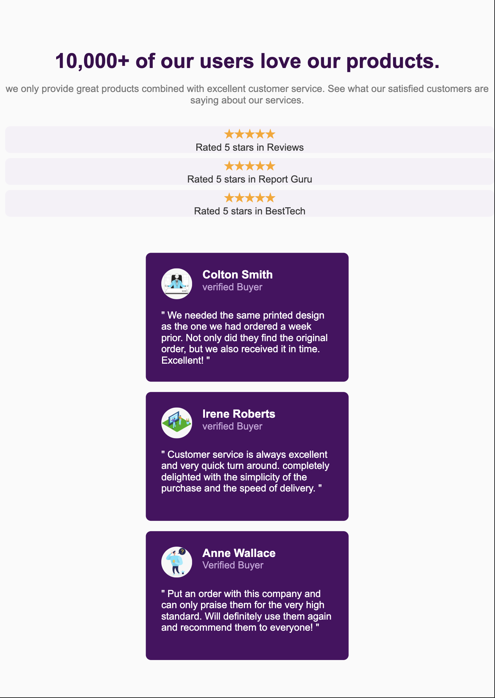
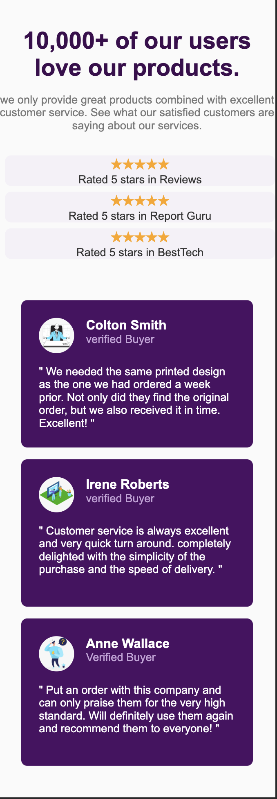
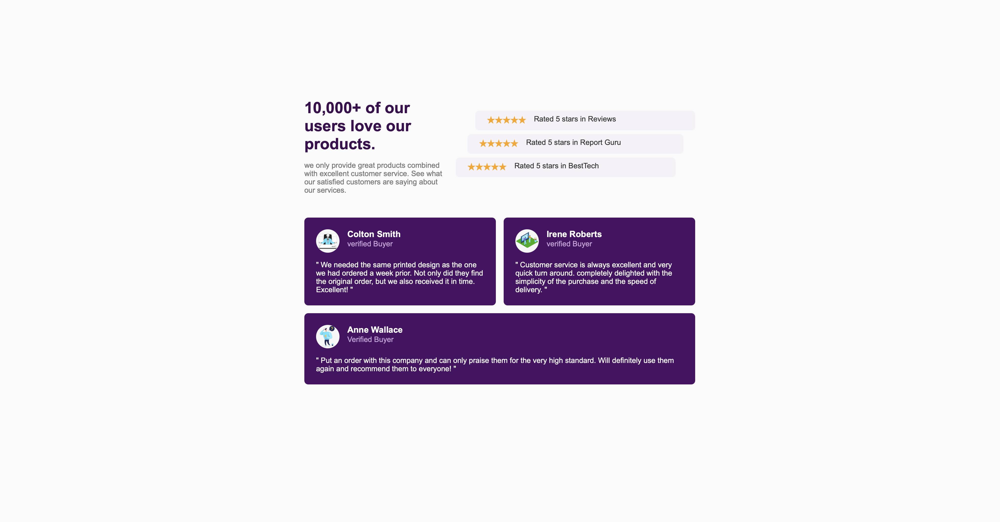

# Projet Social proof

## Spécifications
Ce projet met en avant les témoignages clients et les avis utilisateurs pour renforcer la crédibilité d’un produit ou d’un service. Il présente une interface moderne et responsive affichant :

 * Un titre accrocheur et une courte description de la satisfaction client.
 * Des évaluations sous forme d’étoiles provenant de différentes plateformes.
 * Des cartes de témoignages clients avec photo, nom, statut et avis personnalisé.
 * L’objectif est de rassurer les visiteurs et d’augmenter la confiance grâce à la preuve sociale.

Technologies utilisées : HTML & CSS

## Spécifications
 * Structure HTML sémantique
 * Design responsive
 * Respect du style guide
 * Organisation des fichiers
 * Code propre et commenté

## Procédure suivie:

### Structure HTML:
Pour réaliser ce projet j'ai eu à privilégier des balises ayant des propriété semantique comme les section, article, p, h1, h3,... 
Tout d'abord dans le head, j'ai défini le lien de vers le style css qui sera appliqué à la structure HTML. Puis, dans le body, j'ai créer ma carte à l'intérieur de main. Je l'ai ensuite divisé en deux section, la premiere avec id="top-section", la seconde avec id="bottom-section". top-section contient un header pour le texte et une div pour le ratings (les étoiles). bottom-section qui est réservée pour les commentaires, elle est divisée en deux sous-section dans un but de stylisation plus simple et d'un responsive plus facile. la première sous-section est constituée de deux commentaires, la deuxième d'un seul commentaire.

### Style CSS:
A ce niveau, j'ai séctionné la palette de couleur qui nous avait été donnée, pour les stocker dans des variables avec :root, afin de pouvoir mieux les situés. Pour mieux stylisé les différents container, j'ai privilégier l'utilisation des classes pour ceux qui se répètent afin de les faire hérité d'un design similaire aux container concernés, l'utilisation des flexbox et de ces différents caractéristiques. Au niveau de la responsivité, le design change à partir de la largeur d'écran 768px, où la disposition devient verticale et centrée comme l'illustre l'image qui suit:

## Rendu:

## Liens
### liens vers repo github:
[Github Repositorry](https://github.com/abbas001900/social_proof.git)
### liens vers la github page:
[Github Page](https://abbas001900.github.io/social_proof/)
